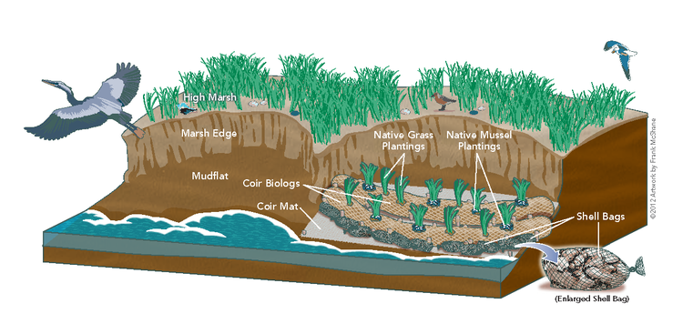

:::info [Help us track this Solution](contribute)
This a sample ChatGPT page to get the ball rolling.

[Click here to contribute content and feedback](contribute)
:::

:::tip [Delaware Living Shorelines Committee](https://www.delawarelivingshorelines.org/) is a great resource
:::

## Overview

In recent years, there has been increasing interest in using coastal wetlands to protect against climate change. Wetlands are effective at sequestering carbon, and they can also help to reduce wave energy and flooding. A number of different technologies have been developed to help protect coastal wetlands, including:

- [Living shorelines](https://www.delawarelivingshorelines.org/): Living shorelines are designed to mimic natural shoreline systems. They typically use a combination of plants, oyster shells, and other materials to stabilize the shoreline and reduce erosion.

- Green infrastructure: Green infrastructure is a term for using plants and trees to help manage stormwater and reduce flooding. Green infrastructure can be used in conjunction with living shorelines to further protect coastal areas.

- Carbon capture and storage: Carbon capture and storage is a technology that can be used to capture carbon dioxide from power plants and other industrial facilities. The carbon dioxide can then be stored underground, preventing it from entering the atmosphere.

A number of companies and organizations are working on developing and implementing these technologies, including the U.S. Environmental Protection Agency, the Nature Conservancy, and the National Oceanic and Atmospheric Administration.

## Progress Made

Some progress has been made in developing Coastal Wetland Protection to reverse climate change. Breakthrough technologies that have been developed include:

- Wetland restoration: This involves creating or restoring wetlands in order to store carbon and reduce greenhouse gas emissions.
- Green infrastructure: This involves using natural systems to manage stormwater and reduce flooding. It can also help to reduce greenhouse gas emissions by storing carbon.
- Living shorelines: This is a type of coastal protection that uses natural materials to stabilize shorelines and reduce erosion. It can also help to store carbon and reduce greenhouse gas emissions.

Some companies and organizations that have been at the forefront of this solution include:

- The Nature Conservancy
- Wetlands International
- The Environmental Defense Fund

## Lessons Learned

Key lessons that have been learned in the development and implementation of Coastal Wetland Protection to reverse climate change:

1. The use of Coastal Wetland Protection to reverse climate change can be successful if implemented properly.

2. There have been failures associated with the technology and its use, but these failures can be used to learn from and improve future implementations.

3. Coastal Wetland Protection is one tool that can be used to help mitigate the effects of climate change, but it is not a cure-all solution.

4. There are a number of organizations and companies working on Coastal Wetland Protection projects, and progress is being made in this area.

## Challenges Ahead

One of the major challenges that remain in the development and implementation of Coastal Wetland Protection to reverse climate change is the lack of awareness and understanding of the benefits of this type of protection. There is a need to educate the public on the importance of coastal wetland protection and the role it plays in mitigating the effects of climate change. Another challenge is the lack of funding for this type of protection. Coastal wetland protection is often seen as a low priority compared to other types of environmental protection, such as air pollution control or water conservation. This is due in part to the fact that coastal wetland protection is often less visible than other types of environmental protection. Finally, there is a need for more research on the effectiveness of different types of coastal wetland protection in order to optimize the benefits of this type of protection.

Some of the companies and organizations that have been at the forefront of this solution are The Nature Conservancy, World Wildlife Fund, and Coastal Wetlands Planning, Protection and Restoration Act. Progress has been made in this area in terms of increasing awareness of the importance of coastal wetland protection and the role it plays in mitigating the effects of climate change. However, more work needs to be done in terms of funding and research in order to fully realize the potential of this type of protection.

## Best Path Forward

The best path forward for the continued development and implementation of Coastal Wetland Protection to effectively mitigate the effects of climate change is to continue to research and develop the technology and to ensure that it is adopted on a large scale. There are a number of steps that need to be taken to ensure that this technology is adopted on a large scale and is effective.

First, it is important to continue to research and develop the technology. There are a number of companies and organizations that have been at the forefront of this solution, and it is important to continue to research and develop the technology to ensure that it is effective.

Second, it is important to ensure that the technology is adopted on a large scale. This can be done by working with governments and organizations to promote the technology and to ensure that it is adopted in areas that are most at risk from climate change.

Third, it is important to ensure that the technology is effective. This can be done by working with experts to ensure that the technology is installed correctly and that it is effective in mitigating the effects of climate change.

Fourth, it is important to monitor the technology to ensure that it is working as intended. This can be done by working with experts to monitor the technology and to make sure that it is working to mitigate the effects of climate change.

Finally, it is important to continue to research and develop the technology. This can be done by working with experts to continue to research and develop the technology to ensure that it is effective in mitigating the effects of climate change.
